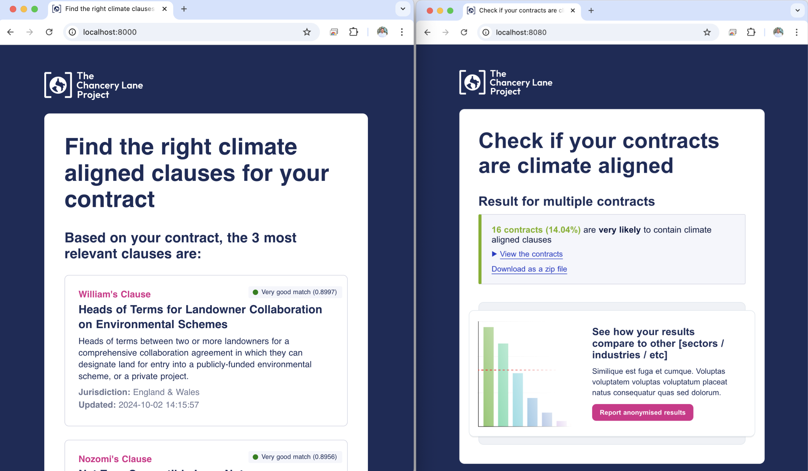

# TCLP x Faculty AI Fellowship December 20204 
## Detecting climate-aligned content in contracts and recommending TCLP content for contracts that are not already climate-aligned

### About the Project
The Chancery Lane Project was interested in exploring how AI could be used to increase organizational impact. This project included three sub-tasks: 
1. **Clause Recommender:** A LegalBERT model was used, along with cosine similarity, to read in a contract or other legal document and recommend which of the existing TCLP clauses would be most appicable. The output is the top three most relevant clauses.
2. **Clause Generation:** In an effort to create a synthetic database of contracts including verbatim TCLP content and clauses inspired by TCLP language, an OpenAI LLM was finetuned on TCLP claueses. Once trained, this model was instructed to generate 1800 novel clauses in TCLP style based on different mixes of three keywords, pulled from the most frequent words in the original ~200 clauses.
3. **Clause Detection**: The crown jewel of the project, the clause detector can take a single file or a folder of files and output the likelhood that a TCLP or TCLP-clause (a.k.a. climate-aligned) is present. This model achieved 94% accuracy on the test set, allowing more efficient and specific metrics for TCLP to measure impact. 
